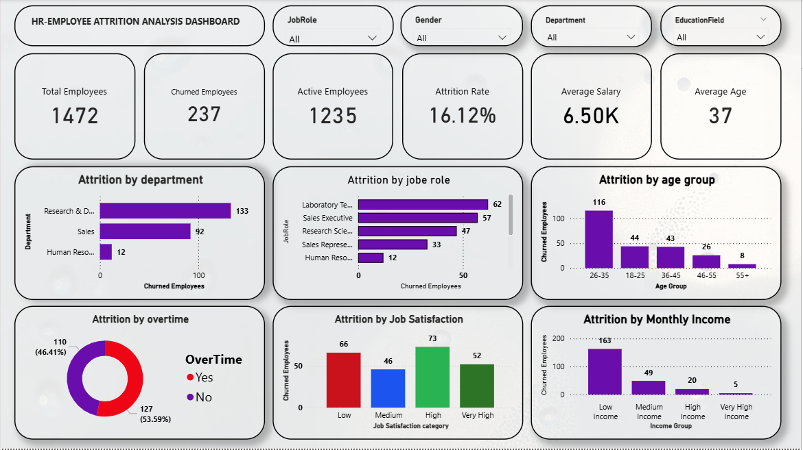

# HR Employee Attrition Analysis Dashboard

**Project Overview**

This project presents an interactive Power BI dashboard developed to analyze employee attrition patterns within an organization. The dashboard provides valuable insights into workforce demographics, employee turnover, job satisfaction, overtime impact, income distribution, and departmental attrition trends.

Through data visualization, KPI tracking, and interactive filtering, the dashboard helps HR professionals identify key factors influencing employee attrition and supports data-driven workforce management decisions.

**Tools Used**

- Power BI
- Excel
- DAX

**Key KPIs**

- Total Employees: 1,472
- Churned Employees: 237
- Active Employees: 1,235
- Attrition Rate: 16.12%
- Average Salary: 6.50K
- Average Age: 37 Years

**Key Insights**

- Research & Development department recorded the highest employee attrition among all departments.
- Employees aged between 26–35 years showed the highest attrition count, indicating a higher turnover rate among early-career professionals.
- Employees working overtime experienced significantly higher attrition compared to those not working overtime.
- Low-income employees contributed the largest share of attrition, suggesting compensation may influence retention.
- Certain job roles such as Laboratory Technicians and Sales Executives experienced higher employee turnover.
- Employees with lower job satisfaction levels demonstrated higher attrition rates compared to employees with higher satisfaction levels.
- Attrition steadily decreased among employees in higher income groups.

 **Business Recommendations**
 
- Improve employee engagement and retention programs within the Research & Development department.
- Review workload distribution and overtime policies to reduce employee burnout.
- Develop competitive compensation and benefits packages for lower-income employee groups.
- Conduct employee satisfaction surveys and implement targeted improvement initiatives.
- Create career development and growth opportunities for employees aged 26–35 years.
- Focus retention strategies on high-attrition job roles to minimize workforce turnover.
- Strengthen work-life balance initiatives to improve employee satisfaction and long-term retention.

**Files Included**
- Power BI Dashboard (.pbix)
- Dataset (.xlsx)
- Dashboard Screenshot (.png)

**Dashboard Screenshot**

**Dataset Preview**

The dataset contains employee information including age, department, job role, income, overtime status, work-life balance, job satisfaction, education, business travel, marital status, and attrition details.

**Business Problem**

Employee attrition can negatively impact organizational productivity, increase recruitment costs, and reduce overall workforce stability. The objective of this project is to identify the key drivers of employee attrition and provide actionable insights that help organizations improve employee retention and workforce planning.

**Final Conclusion**

This dashboard provides a comprehensive view of employee attrition across departments, job roles, age groups, income levels, overtime status, and job satisfaction categories. The analysis reveals that overtime, lower income levels, specific job roles, and lower job satisfaction are key contributors to employee turnover. The insights generated can help organizations design effective retention strategies, improve employee satisfaction, and make informed HR decisions to reduce attrition and strengthen workforce stability.
